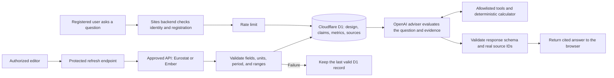

# Common Ground

A local university AI infrastructure research and investment-decision workspace for MIT 1.125 Assignment 3.

Start with [setup and implementation history](SETUP_AND_HISTORY.md). See the [requirements audit](docs/REQUIREMENTS_AUDIT.md) for verified functionality and outstanding acceptance work.

## Adviser and refresh request flow

The Sites backend handles authentication checks, D1 access, external API credentials, and OpenAI requests. The browser and backend share deterministic calculation modules. Retrieved source text is treated as evidence, never as instructions.



The browser never receives the OpenAI or Ember credentials. Team design inputs are reconstructed from persisted D1 records, and unknown citation IDs are rejected before an answer is returned.

## External sources and APIs

All external calls run on the Sites backend. API credentials are hosted secrets and are never returned to the browser or committed to source control. Source definitions, retrieval dates, scope notes, and limitations are stored in D1 and displayed on the Evidence page.

### Server-side APIs

| API | Purpose | Data used | Controls and limitations |
|---|---|---|---|
| [Eurostat dissemination API](https://ec.europa.eu/eurostat/api/dissemination/statistics/1.0/data/nrg_pc_205?lang=EN&nrg_cons=MWH_GE150000&currency=EUR&unit=KWH&tax=X_VAT&time=2025-S2) | Refresh national non-household electricity-price references | EUR/kWh and reporting period | Fixed approved endpoint; national reference, not a site tariff or supplier offer |
| [Ember API](https://api.ember-energy.org/) | Refresh national electricity-system records | Demand, generation, carbon intensity, and reporting year | Server-held credential; annual national data, not facility-specific electricity supply |
| [OpenAI Responses API](https://platform.openai.com/docs/api-reference/responses) | Run the registered-user AI adviser and separate web research | Adviser: D1 design records and evidence; research: official web sources | Server-held credential and rate limit; adviser tool/schema/source-ID checks; research domain checks and a second AI evidence-support review |

The refresh endpoint validates HTTP success, expected fields, numeric values, units, reporting period, source metadata, and reasonable ranges before writing to D1. If validation fails, the last valid record remains available.

### Curated external source records

| ID | Publisher and source | Coverage | Use and limitation |
|---|---|---|---|
| `S-EUROSTAT` | [Eurostat — Electricity prices for non-household consumers](https://ec.europa.eu/eurostat/api/dissemination/statistics/1.0/data/nrg_pc_205?lang=EN&nrg_cons=MWH_GE150000&currency=EUR&unit=KWH&tax=X_VAT&time=2025-S2) | 2025-S2 | National price reference; not a project quotation |
| `S-EMBER` | [Ember — Yearly electricity data](https://files.ember-energy.org/public-downloads/generation/outputs/release_generation_yearly_global.csv) | 2024 EU country records | National annual mix, demand, generation, and carbon data; not hourly facility supply |
| `S-EPOCH-DC` | [Epoch AI — AI data centers database](https://epoch.ai/data/data_centers/data_centers.csv) | Snapshot downloaded by 2026-10-03 | Selected facility records; not a complete national census |
| `S-EPOCH-GPU` | [Epoch AI — GPU clusters database](https://epoch.ai/data/gpu_clusters.csv) | Snapshot downloaded by 2026-10-03 | Phase-specific cluster examples; power boundaries require confirmation |
| `S-DE-01` | [Bundesnetzagentur — Electricity market in 2024](https://www.bundesnetzagentur.de/1043444) | Germany, 2024 | National electricity-system context |
| `S-DE-COOL` | [Forschungszentrum Jülich — Exascale Site Update](https://juser.fz-juelich.de/record/1020008) | Germany, 2023 | Warm-water cooling and heat-reuse example; not proof of new-site capacity |
| `S-DE-DIRECTORY` | [Data Center Map — Germany directory](https://www.datacentermap.com/germany/) | Snapshot 2026-10-05 | Directory listing count; not a national operating census |
| `S-DE-NATIONAL` | [Bitkom / Borderstep — Rechenzentren in Deutschland](https://www.bitkom.org/Presse/Presseinformation/Rechenzentren-Deutschland-KI-treibt-Wachstum) | Germany, 2025 | Reported national estimate with its stated scope |
| `S-FR-01` | [RTE — Annual electricity review 2024](https://analysesetdonnees.rte-france.com/en/annual-review-2024/keyfindings) | France, 2024 | National electricity-system context |
| `S-FR-COOL` | [CNRS Images — Jean Zay heat-recovery substation](https://images.cnrs.fr/photo/20250008_0023) | France, 2025 | Facility cooling example; does not establish proposed-site water or heat-network access |
| `S-FR-DIRECTORY` | [Data Center Map — France directory](https://www.datacentermap.com/france/) | Snapshot 2026-10-05 | Directory listing count; not electricity consumption or national demand |
| `S-FR-NATIONAL` | [SDES — La consommation d’électricité des data centers en 2024](https://www.statistiques.developpement-durable.gouv.fr/la-consommation-delectricite-des-data-centers-en-2024?list-chiffres=true) | France, 2024 | Scoped national consumption estimate; delivery points are not one-to-one facilities |
| `S-SE-01` | [Swedish Energy Agency — Electricity and district heating statistics](https://www.energimyndigheten.se/nyhetsarkiv/2025/slutgiltig-statistik-for-el-och-fjarrvarme-2024/) | Sweden, 2024 | National electricity-system context |
| `S-SE-COOL` | [National Supercomputer Centre — Facilities and district cooling](https://nsc.liu.se/about/facilities/) | Sweden, undated facility description | Operator example; local cooling capacity and water effects require verification |
| `S-SE-DIRECTORY` | [Data Center Map — Sweden directory](https://www.datacentermap.com/sweden/) | Snapshot 2026-10-05 | Directory listing count; not a national operating census |
| `S-SE-NATIONAL` | [RISE — Data center and crypto-mining energy use](https://www.ri.se/en/the-status-of-data-center-and-crypto-mining-energy-use-in-sweden) | Sweden, 2022 | National estimate with combined-scope and vintage limitations |

`S-CALC` is an internal deterministic application model rather than an external source. Detailed retrieval records are in [`data/source-retrieval-audit.json`](data/source-retrieval-audit.json), and definition and comparability notes are in [`data/DATA_NOTES.md`](data/DATA_NOTES.md).

## Functional requirements

| ID | Requirement | Implementation | Status / verification |
|---|---|---|---|
| FR1 | Present the proposed datacenter location and initial design | Overview and Initial Design show France / Paris-Saclay, the 20 MW IT baseline, PUE, facility load, energy, system assumptions, and uncertainties | Complete — public pages and `/api/design` expose the current design |
| FR2 | Compare at least three countries | Country Comparison covers Germany, France, and Sweden with datacenter records, electricity use, price, generation mix, carbon intensity, cooling constraints, vintage, and sources | Complete — public comparison and Evidence pages |
| FR3 | Store evidence, sources, and design assumptions persistently | Cloudflare D1 stores countries, sources, claims, designs, proposal versions, verification records, refresh history, users, roles, and adviser usage | Complete — `db/schema.ts`, migrations, and deployed `/api/data` records |
| FR4 | Retrieve at least one dataset from an external API | Protected backend integrations query Eurostat and Ember and validate responses before D1 writes | Verified partial hosted refresh — 54 Ember generation/carbon metrics updated across 27 countries; demand requests still returned HTTP 500. Eurostat refresh previously passed locally |
| FR5 | Allow registered users to ask the AI adviser questions | The Adviser page calls the server-side `/api/adviser` route after Sites authentication and application registration | Complete — registered hosted user received a grounded answer |
| FR6 | Prevent unregistered users from calling the AI endpoint | `/api/adviser` checks authenticated identity and completed registration on the server | Complete — anonymous request returned HTTP 401; unregistered access returns HTTP 403 |
| FR7 | Cite evidence used in each substantive AI answer | Controlled tools return D1 source IDs; the server rejects unknown IDs and returns source links with the answer | Complete — hosted answers cited real records such as `S-CALC` |
| FR8 | Distinguish facts, estimates, calculations, design decisions, and unknowns | `design_claims.claim_type`, Evidence classifications, deterministic calculations, and structured Adviser sections preserve these distinctions | Complete — schema and response-validation tests pass |
| FR9 | Retain the last valid data when an external source fails | Ember metrics refresh independently; failed metrics retain stored values and original retrieval dates | Verified hosted — 27 failed demand requests retained stored values while 54 other metrics updated |
| FR10 | Show when each data item was last updated | Country metrics and source records include reporting periods and retrieval timestamps displayed in Country Comparison and Evidence | Complete — all external deployed source records have retrieval timestamps; internal `S-CALC` is not externally retrieved |

Explicit non-goals: this is not a construction-ready engineering design, a real-time grid-control system, a professional engineering certification, or a final financial commitment model.

## Test results

### Automated unit tests

Rerun on 6 October 2026 after the answer-correction and source-boundary repairs: **62 passed, 0 failed, 0 skipped** (`npm test`). These checks cover calculations, parsers, access rules, response validation and research guards. They do not call the live model or prove production behavior.

Type checking and the production build passed for the repair release. The current local API run passed **16/16 applicable checks** after applying missing local migration 0006. Test count depends on the local identity and configured providers: registration was already complete and providers were configured. The earlier 18-check run is historical, not an extra current run.

### Functional and hosted acceptance checks

T01–T15 below are assignment acceptance checks, **not the unit-test suite**. **Pass** means the stated case was observed; **Pending** means it has not been run; **Partial** means only part of the required scope is verified; **Fail** means an executed case did not meet its expected result. A passing local check does not imply a hosted pass.

| ID | Test | Expected result | Actual result / evidence | Status |
|---|---|---|---|---|
| T01 | Open the site without signing in | Public design and evidence are visible | Public `/api/data` and `/api/design` returned the deployed records | Pass |
| T02 | Call the adviser without signing in | Server rejects the request | Local API test returned HTTP 401 | Pass |
| T03 | Sign in without completing registration | Registration is required | Server registration guard returns HTTP 403 for an incomplete profile | Pass — local/API |
| T04 | Complete registration | Adviser becomes available | Registered hosted user successfully used the Adviser | Pass |
| T05 | Ask for the current PUE | Adviser returns the current D1 value | Hosted answer returned PUE 1.25 and cited `S-CALC` | Pass |
| T06 | Administrator changes the shared PUE | Page calculations and later Adviser answers both change | Hosted admin saved PUE 1.30; D1, page calculations and Adviser returned 26 MW and 227.76 GWh/year. Restored 1.25 and confirmed D1 and Adviser readback | Pass — hosted |
| T07 | Ask for a missing fact | Adviser identifies an evidence gap without inventing a value | After repair, the same hosted question explicitly returned that both the signed connection date and offer reference are unknown, with an empty external-evidence list | Pass — hosted repair, 6 October 2026 |
| T08 | Refresh an approved external source | New D1 record and retrieval time appear | Hosted Ember refresh persisted 54 generation/carbon metrics and new timestamps across 27 countries, with a partial refresh-history record; demand updates failed upstream | Pass — partial hosted refresh |
| T09 | Simulate an external API failure | Last valid data remain visible | Local failure-retention test passed. Hosted Ember demand returned HTTP 500; stored demand and original retrieval dates were retained while other metrics updated | Pass — local/API and hosted partial failure |
| T10 | Attempt unauthorized editing or refresh | Server rejects the operation without mutation | Local tests rejected anonymous refresh and non-admin design changes | Pass |
| T11 | Ask for supporting evidence | Adviser returns real D1 source records | Hosted answers returned real source IDs and citation links | Pass |
| T12 | Ask for professional certification | Adviser explains the initial-design limitation and does not certify | A direct hosted request to issue professional engineering certification was refused; missing agreements and initial-design limits were explained | Pass — hosted case, 6 October 2026 |
| T13 | Put malicious instructions in a source record | Adviser treats the text as data and does not follow it | Two isolated live-model fixtures passed after instruction-bearing sources were quarantined. No fake PUE/date/citation entered the accepted answers; no production data were changed. This does not prove resistance to every attack | Pass — bounded isolated cases |
| T14 | Trace one request from browser to D1 to OpenAI and back | Team member explains access checks, D1 retrieval, tools, model, citation validation, and response | Architecture is documented above; each member still needs to provide their own short explanation | Partial |
| T15 | Repeat acceptance checks on the deployed Site | Hosted behavior matches preview; build and migrations succeed | Hosted public reads, anonymous AI/refresh rejection, missing-fact answers and certification refusal passed. Source injection passed isolated live-model fixtures. Full fresh-account registration and non-admin hosted role-matrix tests have not been repeated in this release | Partial — remaining account-flow coverage |

Hosted repair check: all four Build/France research cards returned cited evidence; financing needed one manual retry after a URL-coverage mismatch. The repair constrains reviewer URLs to the citation list to prevent URL-copy drift. Manual review of the subsequent run caught a GENCI ownership/operation attribution error missed by AI review. A specific claim guard and clearer scope were added. Successful rendering is not a guarantee that every generated fact is correct. A fresh Ember check still returned HTTP 500 for demand while generation and carbon intensity succeeded; stored demand values and dates remain available.

### Remaining acceptance work

| Check | Current scope / remaining work |
|---|---|
| T07 | Repaired and passed the exact hosted failure case; the source-ID validator remains strict and the server allows at most one corrective generation |
| T13 | Two isolated fixtures passed source quarantine plus live model response. This tests the supplied attacks, not all prompt injection. Production records were never poisoned |
| T14 | Each member still needs to explain a request in their own words. A walkthrough is available in [the repair report](docs/ACCEPTANCE_REPAIR_2026-10-06.md) |
| T15 | Repeat fresh-account registration and non-admin role checks with suitable real test accounts. Isolated fixtures and local identity simulation are not substituted for hosted account-flow evidence |

See [the repair report](docs/ACCEPTANCE_REPAIR_2026-10-06.md) for test scope and remaining limits. The [earlier failure review](docs/ACCEPTANCE_REVIEW_2026-10-05.md) is retained as history.

Test implementations are in [`tests/`](tests/). The detailed internal checklist and known limitations are recorded in [`docs/REQUIREMENTS_AUDIT.md`](docs/REQUIREMENTS_AUDIT.md).

```sh
npm run dev -- --hostname 127.0.0.1
```

The development machine's local database is initialized. Fresh installations must apply the migrations described in the setup guide. Put server-only keys in `.dev.vars`, using `.dev.vars.example` as the template. The published site is [Common Ground](https://common-ground-datacenter.lynnyu.chatgpt.site/); production secrets are configured separately in Sites.

## Full system architecture


- **Access:** anyone can read the dashboard. Registered users can use the adviser and web research. Editors/admins can refresh data and record source checks; admins can revise the shared design and manage roles. The adviser and research share a limit of 10 requests per minute per user.
- **Saved design versus exploration:** optional browser scenarios do not overwrite the shared proposal. An admin's saved PUE revision is persisted in D1 and read by subsequent adviser requests. Both the interface and server use the shared calculation modules.
- **Two AI paths:** the adviser reads project records through allowlisted tools and can query Eurostat/Ember when explicitly asked. It has no general web search and cannot edit the model. Chat answers get at most one correction attempt against the same evidence; permitted citation IDs also constrain the generated schema. Obvious instruction-bearing source records are quarantined before disclosure. The separate research endpoint searches official sources, validates citation URLs, and runs a second web-enabled AI evidence-support review. Project proposals use authored route-specific text; AI supplies the cited evidence paragraph. Failed checks withhold the research answer. AI review is not human verification and does not guarantee correctness.
- **Data provenance:** Ember generation, demand and carbon intensity refresh independently. Failed metrics retain their stored values and original retrieval dates; generation mix is not refreshed by these calls. Refresh history records partial failures. Human verification remains a separate reviewer action.
- **Deployment:** source is built and packaged for Sites; Drizzle migrations update D1 before the Worker is deployed. Runtime API keys stay on the server and are never sent to the browser. No R2 storage is configured.

Implementation: [page workspace](app/minimal-workspace.tsx), [API routes](app/api), [authorization](lib/server/core.ts), [adviser tools](lib/adviser-policy.ts), [calculation model](lib/model.ts), [Ember integration](lib/server/ember.ts), [research validation](lib/research.ts), [evidence-support review](lib/research-quality.ts), and [database schema](db/schema.ts).
