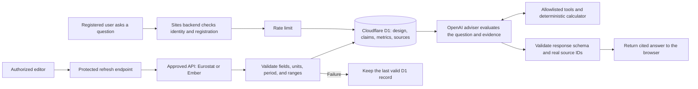

# Common Ground

A local university AI infrastructure research and investment-decision workspace for MIT 1.125 Assignment 3.

Start with [setup and implementation history](SETUP_AND_HISTORY.md). See the [requirements audit](docs/REQUIREMENTS_AUDIT.md) for verified functionality and outstanding acceptance work.

## Software architecture

The application keeps authentication, D1 access, external API credentials, deterministic calculations, and OpenAI requests on the Sites backend. Retrieved source text is treated as evidence, never as instructions.



The browser never receives the OpenAI or Ember credentials. Team design inputs are reconstructed from persisted D1 records, and unknown citation IDs are rejected before an answer is returned.

```sh
npm run dev -- --hostname 127.0.0.1
```

The development machine's local database is initialized. Fresh installations must apply the migrations described in the setup guide. Put server-only keys in `.dev.vars`, using `.dev.vars.example` as the template. The website has not been deployed.
