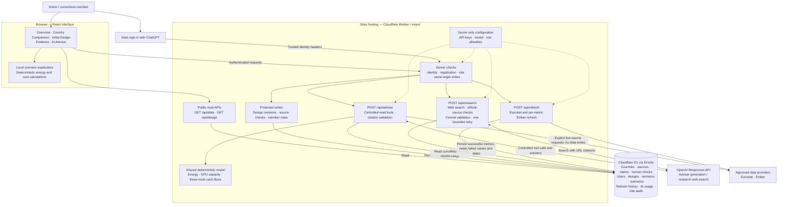

# Common Ground

A local university AI infrastructure research and investment-decision workspace for MIT 1.125 Assignment 3.

Start with [setup and implementation history](SETUP_AND_HISTORY.md). See the [requirements audit](docs/REQUIREMENTS_AUDIT.md) for verified functionality and outstanding acceptance work.

```sh
npm run dev -- --hostname 127.0.0.1
```

The development machine's local database is initialized. Fresh installations must apply the migrations described in the setup guide. Put server-only keys in `.dev.vars`, using `.dev.vars.example` as the template. The published site is [Common Ground](https://common-ground-datacenter.lynnyu.chatgpt.site/); production secrets are configured separately in Sites.

## Architecture



- **Access:** anyone can read the dashboard. Registered users can use the adviser and web research. Editors/admins can refresh data and record source checks; admins can revise the shared design and manage roles. The adviser and research share a limit of 10 requests per minute per user.
- **Saved design versus exploration:** optional browser scenarios do not overwrite the shared proposal. An admin's saved PUE revision is persisted in D1 and read by subsequent adviser requests. Both the interface and server use the shared calculation modules.
- **Two AI paths:** the adviser reads project records through allowlisted tools and can query Eurostat/Ember when explicitly asked. It has no general web search and cannot edit the model. The separate research endpoint searches the web and validates citation URLs against approved official domains. These checks do not guarantee that every generated claim is supported.
- **Data provenance:** Ember generation, demand and carbon intensity refresh independently. Failed metrics retain their stored values and original retrieval dates; generation mix is not refreshed by these calls. Refresh history records partial failures. Human verification remains a separate reviewer action.
- **Deployment:** source is built and packaged for Sites; Drizzle migrations update D1 before the Worker is deployed. Runtime API keys stay on the server and are never sent to the browser. No R2 storage is configured.

Implementation: [page workspace](app/minimal-workspace.tsx), [API routes](app/api), [authorization](lib/server/core.ts), [adviser tools](lib/adviser-policy.ts), [calculation model](lib/model.ts), [Ember integration](lib/server/ember.ts), [research validation](lib/research.ts), and [database schema](db/schema.ts).
