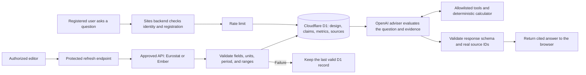

# Common Ground

A local university AI infrastructure research and investment-decision workspace for MIT 1.125 Assignment 3.

Start with [setup and implementation history](SETUP_AND_HISTORY.md). See the [requirements audit](docs/REQUIREMENTS_AUDIT.md) for verified functionality and outstanding acceptance work.

## Software architecture

The application keeps authentication, D1 access, external API credentials, deterministic calculations, and OpenAI requests on the Sites backend. Retrieved source text is treated as evidence, never as instructions.



The browser never receives the OpenAI or Ember credentials. Team design inputs are reconstructed from persisted D1 records, and unknown citation IDs are rejected before an answer is returned.

## External sources and APIs

All external calls run on the Sites backend. API credentials are hosted secrets and are never returned to the browser or committed to source control. Source definitions, retrieval dates, scope notes, and limitations are stored in D1 and displayed on the Evidence page.

### Server-side APIs

| API | Purpose | Data used | Controls and limitations |
|---|---|---|---|
| [Eurostat dissemination API](https://ec.europa.eu/eurostat/api/dissemination/statistics/1.0/data/nrg_pc_205?lang=EN&nrg_cons=MWH_GE150000&currency=EUR&unit=KWH&tax=X_VAT&time=2025-S2) | Refresh national non-household electricity-price references | EUR/kWh and reporting period | Fixed approved endpoint; national reference, not a site tariff or supplier offer |
| [Ember API](https://api.ember-energy.org/) | Refresh national electricity-system records | Demand, generation, carbon intensity, and reporting year | Server-held credential; annual national data, not facility-specific electricity supply |
| [OpenAI Responses API](https://platform.openai.com/docs/api-reference/responses) | Run the registered-user AI adviser | Relevant D1 design records, metrics, claims, and source metadata | Server-held credential, rate limit, allowlisted tools, structured output, and real-source-ID validation |

The refresh endpoint validates HTTP success, expected fields, numeric values, units, reporting period, source metadata, and reasonable ranges before writing to D1. If validation fails, the last valid record remains available.

### Curated external source records

| ID | Publisher and source | Coverage | Use and limitation |
|---|---|---|---|
| `S-EUROSTAT` | [Eurostat — Electricity prices for non-household consumers](https://ec.europa.eu/eurostat/api/dissemination/statistics/1.0/data/nrg_pc_205?lang=EN&nrg_cons=MWH_GE150000&currency=EUR&unit=KWH&tax=X_VAT&time=2025-S2) | 2025-S2 | National price reference; not a project quotation |
| `S-EMBER` | [Ember — Yearly electricity data](https://files.ember-energy.org/public-downloads/generation/outputs/release_generation_yearly_global.csv) | 2024 EU country records | National annual mix, demand, generation, and carbon data; not hourly facility supply |
| `S-EPOCH-DC` | [Epoch AI — AI data centers database](https://epoch.ai/data/data_centers/data_centers.csv) | Snapshot downloaded by 2026-10-03 | Selected facility records; not a complete national census |
| `S-EPOCH-GPU` | [Epoch AI — GPU clusters database](https://epoch.ai/data/gpu_clusters.csv) | Snapshot downloaded by 2026-10-03 | Phase-specific cluster examples; power boundaries require confirmation |
| `S-DE-01` | [Bundesnetzagentur — Electricity market in 2024](https://www.bundesnetzagentur.de/1043444) | Germany, 2024 | National electricity-system context |
| `S-DE-COOL` | [Forschungszentrum Jülich — Exascale Site Update](https://juser.fz-juelich.de/record/1020008) | Germany, 2023 | Warm-water cooling and heat-reuse example; not proof of new-site capacity |
| `S-DE-DIRECTORY` | [Data Center Map — Germany directory](https://www.datacentermap.com/germany/) | Snapshot 2026-10-05 | Directory listing count; not a national operating census |
| `S-DE-NATIONAL` | [Bitkom / Borderstep — Rechenzentren in Deutschland](https://www.bitkom.org/Presse/Presseinformation/Rechenzentren-Deutschland-KI-treibt-Wachstum) | Germany, 2025 | Reported national estimate with its stated scope |
| `S-FR-01` | [RTE — Annual electricity review 2024](https://analysesetdonnees.rte-france.com/en/annual-review-2024/keyfindings) | France, 2024 | National electricity-system context |
| `S-FR-COOL` | [CNRS Images — Jean Zay heat-recovery substation](https://images.cnrs.fr/photo/20250008_0023) | France, 2025 | Facility cooling example; does not establish proposed-site water or heat-network access |
| `S-FR-DIRECTORY` | [Data Center Map — France directory](https://www.datacentermap.com/france/) | Snapshot 2026-10-05 | Directory listing count; not electricity consumption or national demand |
| `S-FR-NATIONAL` | [SDES — La consommation d’électricité des data centers en 2024](https://www.statistiques.developpement-durable.gouv.fr/la-consommation-delectricite-des-data-centers-en-2024?list-chiffres=true) | France, 2024 | Scoped national consumption estimate; delivery points are not one-to-one facilities |
| `S-SE-01` | [Swedish Energy Agency — Electricity and district heating statistics](https://www.energimyndigheten.se/nyhetsarkiv/2025/slutgiltig-statistik-for-el-och-fjarrvarme-2024/) | Sweden, 2024 | National electricity-system context |
| `S-SE-COOL` | [National Supercomputer Centre — Facilities and district cooling](https://nsc.liu.se/about/facilities/) | Sweden, undated facility description | Operator example; local cooling capacity and water effects require verification |
| `S-SE-DIRECTORY` | [Data Center Map — Sweden directory](https://www.datacentermap.com/sweden/) | Snapshot 2026-10-05 | Directory listing count; not a national operating census |
| `S-SE-NATIONAL` | [RISE — Data center and crypto-mining energy use](https://www.ri.se/en/the-status-of-data-center-and-crypto-mining-energy-use-in-sweden) | Sweden, 2022 | National estimate with combined-scope and vintage limitations |

`S-CALC` is an internal deterministic application model rather than an external source. Detailed retrieval records are in [`data/source-retrieval-audit.json`](data/source-retrieval-audit.json), and definition and comparability notes are in [`data/DATA_NOTES.md`](data/DATA_NOTES.md).

```sh
npm run dev -- --hostname 127.0.0.1
```

The development machine's local database is initialized. Fresh installations must apply the migrations described in the setup guide. Put server-only keys in `.dev.vars`, using `.dev.vars.example` as the template. The website has not been deployed.
