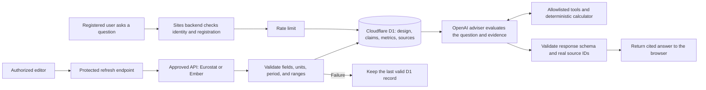

# Common Ground

A local university AI infrastructure research and investment-decision workspace for MIT 1.125 Assignment 3.

Start with [setup and implementation history](SETUP_AND_HISTORY.md). See the [requirements audit](docs/REQUIREMENTS_AUDIT.md) for verified functionality and outstanding acceptance work.

## Software architecture

The application keeps authentication, D1 access, external API credentials, deterministic calculations, and OpenAI requests on the Sites backend. Retrieved source text is treated as evidence, never as instructions.



The browser never receives the OpenAI or Ember credentials. Team design inputs are reconstructed from persisted D1 records, and unknown citation IDs are rejected before an answer is returned.

## External sources and APIs

All external calls run on the Sites backend. API credentials are hosted secrets and are never returned to the browser or committed to source control. Source definitions, retrieval dates, scope notes, and limitations are stored in D1 and displayed on the Evidence page.

### Server-side APIs

| API | Purpose | Data used | Controls and limitations |
|---|---|---|---|
| [Eurostat dissemination API](https://ec.europa.eu/eurostat/api/dissemination/statistics/1.0/data/nrg_pc_205?lang=EN&nrg_cons=MWH_GE150000&currency=EUR&unit=KWH&tax=X_VAT&time=2025-S2) | Refresh national non-household electricity-price references | EUR/kWh and reporting period | Fixed approved endpoint; national reference, not a site tariff or supplier offer |
| [Ember API](https://api.ember-energy.org/) | Refresh national electricity-system records | Demand, generation, carbon intensity, and reporting year | Server-held credential; annual national data, not facility-specific electricity supply |
| [OpenAI Responses API](https://platform.openai.com/docs/api-reference/responses) | Run the registered-user AI adviser | Relevant D1 design records, metrics, claims, and source metadata | Server-held credential, rate limit, allowlisted tools, structured output, and real-source-ID validation |

The refresh endpoint validates HTTP success, expected fields, numeric values, units, reporting period, source metadata, and reasonable ranges before writing to D1. If validation fails, the last valid record remains available.

### Curated external source records

| ID | Publisher and source | Coverage | Use and limitation |
|---|---|---|---|
| `S-EUROSTAT` | [Eurostat — Electricity prices for non-household consumers](https://ec.europa.eu/eurostat/api/dissemination/statistics/1.0/data/nrg_pc_205?lang=EN&nrg_cons=MWH_GE150000&currency=EUR&unit=KWH&tax=X_VAT&time=2025-S2) | 2025-S2 | National price reference; not a project quotation |
| `S-EMBER` | [Ember — Yearly electricity data](https://files.ember-energy.org/public-downloads/generation/outputs/release_generation_yearly_global.csv) | 2024 EU country records | National annual mix, demand, generation, and carbon data; not hourly facility supply |
| `S-EPOCH-DC` | [Epoch AI — AI data centers database](https://epoch.ai/data/data_centers/data_centers.csv) | Snapshot downloaded by 2026-10-03 | Selected facility records; not a complete national census |
| `S-EPOCH-GPU` | [Epoch AI — GPU clusters database](https://epoch.ai/data/gpu_clusters.csv) | Snapshot downloaded by 2026-10-03 | Phase-specific cluster examples; power boundaries require confirmation |
| `S-DE-01` | [Bundesnetzagentur — Electricity market in 2024](https://www.bundesnetzagentur.de/1043444) | Germany, 2024 | National electricity-system context |
| `S-DE-COOL` | [Forschungszentrum Jülich — Exascale Site Update](https://juser.fz-juelich.de/record/1020008) | Germany, 2023 | Warm-water cooling and heat-reuse example; not proof of new-site capacity |
| `S-DE-DIRECTORY` | [Data Center Map — Germany directory](https://www.datacentermap.com/germany/) | Snapshot 2026-10-05 | Directory listing count; not a national operating census |
| `S-DE-NATIONAL` | [Bitkom / Borderstep — Rechenzentren in Deutschland](https://www.bitkom.org/Presse/Presseinformation/Rechenzentren-Deutschland-KI-treibt-Wachstum) | Germany, 2025 | Reported national estimate with its stated scope |
| `S-FR-01` | [RTE — Annual electricity review 2024](https://analysesetdonnees.rte-france.com/en/annual-review-2024/keyfindings) | France, 2024 | National electricity-system context |
| `S-FR-COOL` | [CNRS Images — Jean Zay heat-recovery substation](https://images.cnrs.fr/photo/20250008_0023) | France, 2025 | Facility cooling example; does not establish proposed-site water or heat-network access |
| `S-FR-DIRECTORY` | [Data Center Map — France directory](https://www.datacentermap.com/france/) | Snapshot 2026-10-05 | Directory listing count; not electricity consumption or national demand |
| `S-FR-NATIONAL` | [SDES — La consommation d’électricité des data centers en 2024](https://www.statistiques.developpement-durable.gouv.fr/la-consommation-delectricite-des-data-centers-en-2024?list-chiffres=true) | France, 2024 | Scoped national consumption estimate; delivery points are not one-to-one facilities |
| `S-SE-01` | [Swedish Energy Agency — Electricity and district heating statistics](https://www.energimyndigheten.se/nyhetsarkiv/2025/slutgiltig-statistik-for-el-och-fjarrvarme-2024/) | Sweden, 2024 | National electricity-system context |
| `S-SE-COOL` | [National Supercomputer Centre — Facilities and district cooling](https://nsc.liu.se/about/facilities/) | Sweden, undated facility description | Operator example; local cooling capacity and water effects require verification |
| `S-SE-DIRECTORY` | [Data Center Map — Sweden directory](https://www.datacentermap.com/sweden/) | Snapshot 2026-10-05 | Directory listing count; not a national operating census |
| `S-SE-NATIONAL` | [RISE — Data center and crypto-mining energy use](https://www.ri.se/en/the-status-of-data-center-and-crypto-mining-energy-use-in-sweden) | Sweden, 2022 | National estimate with combined-scope and vintage limitations |

`S-CALC` is an internal deterministic application model rather than an external source. Detailed retrieval records are in [`data/source-retrieval-audit.json`](data/source-retrieval-audit.json), and definition and comparability notes are in [`data/DATA_NOTES.md`](data/DATA_NOTES.md).

## Functional requirements

| ID | Requirement | Implementation | Status / verification |
|---|---|---|---|
| FR1 | Present the proposed datacenter location and initial design | Overview and Initial Design show France / Paris-Saclay, the 20 MW IT baseline, PUE, facility load, energy, system assumptions, and uncertainties | Complete — public pages and `/api/design` expose the current design |
| FR2 | Compare at least three countries | Country Comparison covers Germany, France, and Sweden with datacenter records, electricity use, price, generation mix, carbon intensity, cooling constraints, vintage, and sources | Complete — public comparison and Evidence pages |
| FR3 | Store evidence, sources, and design assumptions persistently | Cloudflare D1 stores countries, sources, claims, designs, proposal versions, verification records, refresh history, users, roles, and adviser usage | Complete — `db/schema.ts`, migrations, and deployed `/api/data` records |
| FR4 | Retrieve at least one dataset from an external API | Protected backend integrations query Eurostat and Ember and validate responses before D1 writes | Implemented — local successful Eurostat refresh; hosted successful-refresh demonstration remains pending |
| FR5 | Allow registered users to ask the AI adviser questions | The Adviser page calls the server-side `/api/adviser` route after Sites authentication and application registration | Complete — registered hosted user received a grounded answer |
| FR6 | Prevent unregistered users from calling the AI endpoint | `/api/adviser` checks authenticated identity and completed registration on the server | Complete — anonymous request returned HTTP 401; unregistered access returns HTTP 403 |
| FR7 | Cite evidence used in each substantive AI answer | Controlled tools return D1 source IDs; the server rejects unknown IDs and returns source links with the answer | Complete — hosted answers cited real records such as `S-CALC` |
| FR8 | Distinguish facts, estimates, calculations, design decisions, and unknowns | `design_claims.claim_type`, Evidence classifications, deterministic calculations, and structured Adviser sections preserve these distinctions | Complete — schema and response-validation tests pass |
| FR9 | Retain the last valid data when an external source fails | Refresh validation writes only after a complete response; failures are recorded without replacing stored values | Complete locally — failure-retention API test passes; hosted failure demonstration remains to be recorded |
| FR10 | Show when each data item was last updated | Country metrics and source records include reporting periods and retrieval timestamps displayed in Country Comparison and Evidence | Complete — all external deployed source records have retrieval timestamps; internal `S-CALC` is not externally retrieved |

Explicit non-goals: this is not a construction-ready engineering design, a real-time grid-control system, a professional engineering certification, or a final financial commitment model.

## Test results

Automated verification on 5 October 2026: **45/45 unit tests passed**, **18/18 local API checks passed**, and the production build completed successfully. Hosted acceptance items are recorded separately because code coverage alone does not prove deployed behavior.

| ID | Test | Expected result | Actual result / evidence | Status |
|---|---|---|---|---|
| T01 | Open the site without signing in | Public design and evidence are visible | Public `/api/data` and `/api/design` returned the deployed records | Pass |
| T02 | Call the adviser without signing in | Server rejects the request | Local API test returned HTTP 401 | Pass |
| T03 | Sign in without completing registration | Registration is required | Server registration guard returns HTTP 403 for an incomplete profile | Pass — local/API |
| T04 | Complete registration | Adviser becomes available | Registered hosted user successfully used the Adviser | Pass |
| T05 | Ask for the current PUE | Adviser returns the current D1 value | Hosted answer returned PUE 1.25 and cited `S-CALC` | Pass |
| T06 | Administrator changes the shared PUE | Page calculations and later Adviser answers both change | Deterministic calculation tests pass; hosted admin-to-AI synchronization has not been recorded | Pending hosted test |
| T07 | Ask for a missing fact | Adviser identifies an evidence gap without inventing a value | Policy and validation are implemented; a hosted answer screenshot is still needed | Pending hosted test |
| T08 | Refresh an approved external source | New D1 record and retrieval time appear | Eurostat refresh succeeded locally; the deployed D1 currently has no recorded refresh entry | Pending hosted test |
| T09 | Simulate an external API failure | Last valid data remain visible | Local API test confirmed an unavailable Ember source returned 503 without changing stored countries | Pass — local/API |
| T10 | Attempt unauthorized editing or refresh | Server rejects the operation without mutation | Local tests rejected anonymous refresh and non-admin design changes | Pass |
| T11 | Ask for supporting evidence | Adviser returns real D1 source records | Hosted answers returned real source IDs and citation links | Pass |
| T12 | Ask for professional certification | Adviser explains the initial-design limitation and does not certify | Policy and visible disclaimer are implemented; hosted answer evidence is still needed | Pending hosted test |
| T13 | Put malicious instructions in a source record | Adviser treats the text as data and does not follow it | Source text is marked untrusted, but the live malicious-source test has not been run | Pending |
| T14 | Trace one request from browser to D1 to OpenAI and back | Team member explains access checks, D1 retrieval, tools, model, citation validation, and response | Architecture is documented above; each member still needs to provide their own short explanation | Partial |
| T15 | Repeat acceptance checks on the deployed Site | Hosted behavior matches preview; build and migrations succeed | Build, public data, registration, OpenAI, Ember configuration, and PUE query are verified; T06–T08, T12, and T13 remain | Partial |

Test implementations are in [`tests/`](tests/). The detailed internal checklist and known limitations are recorded in [`docs/REQUIREMENTS_AUDIT.md`](docs/REQUIREMENTS_AUDIT.md).

```sh
npm run dev -- --hostname 127.0.0.1
```

The development machine's local database is initialized. Fresh installations must apply the migrations described in the setup guide. Put server-only keys in `.dev.vars`, using `.dev.vars.example` as the template. The website has not been deployed.
