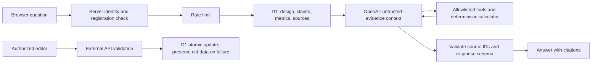

# Common Ground：本地第一版

这是 MIT 1.125 Assignment 3 的欧盟 AI 数据中心研究网站。当前只在本地运行，尚未发布。

## 打开网站

预览地址：http://127.0.0.1:5173/

依赖与本地数据库已经准备好。之后重新启动：

```sh
cd /Users/milasmac/Desktop/MIT1.125/MIT1.125-ass3/website
npm run dev -- --hostname 127.0.0.1
```

需要 Node.js 22.13 或更新版本。启动脚本也会自动寻找此电脑的 Codex Node 24 运行环境。

## 填写两个 Key

编辑 `website/.dev.vars`，填写已有的两个空位：

```dotenv
OPENAI_API_KEY=在本地填写你的OpenAI密钥
EMBER_API_KEY=在本地填写你的Ember密钥
OPENAI_MODEL=gpt-4.1-mini
EDITOR_USER_IDS=local_seedy
```

数据提供商名称为 **Ember**。保存后停止并重新运行开发服务器。不要把 Key 发进聊天，也不要放入 React 组件、公开环境变量或数据文件。`.dev.vars` 已被 Git 忽略；`.dev.vars.example` 只保留空白模板。以后部署时需在托管平台的服务端 secrets 中配置，不能上传这个本地文件。

OpenAI 调用由服务器发起，使用 Responses API、受控数据查询、来源与人工核实记录读取、计算工具，返回来源引用。页面只知道是否配置成功。每个注册用户每天最多 20 次请求；这只是应用限额，仍应在自己的 OpenAI 项目中设置适当的用量控制。尚未进行真实付费调用，模型访问权限需用你的账号验证。

## 页面与跨页问答

| 页面 | 第一版功能 |
| --- | --- |
| Explore Europe | EU27 真实边界地图、数据覆盖状态、国家简报；默认德国、法国、瑞典 |
| Compare countries | 同时比较 3–5 国，统一电价口径、电力结构、排放强度、Epoch 案例和缺失项 |
| Initial design | 容量假设、供电示意、故障及 48 小时断电讨论、需求与治理草案 |
| Costs & scenarios | 自建、租赁、混合方案 × 基准、电网延期、利用率减半；10 年现金流、敏感性、保存和导出 |
| Evidence library | 原始来源、定义、检索时间、人工核实表单、编辑者数据刷新及日志 |
| 每页右下角 Adviser | 跨页保留对话，发送当前页、国家、情景和最近对话；受控计算和真实来源引用 |

## 本地登录与人工核实

未登录时首先显示登录入口，登录并完成注册后进入工作区。已登录的用户继续使用现有会话。数据与共享设计接口也要求注册身份。使用本地模拟登录进入预览。此身份仅用于开发测试，不代表真实 ChatGPT 认证。首次使用需填写应用注册资料。QA 检查已创建名为 Local preview tester 的本地测试资料。

`local_seedy` 在本地开发模式中被列为 editor，因此可以保存共享设计、刷新数据、记录人工核实。正式发布前必须换成真实认证用户 ID，并验证 viewer/editor 权限。

人工核实默认没有完成。请亲自打开原文，确认具体主张、段落或表格、单位与适用范围，再在来源抽屉中填写核实记录并勾选声明。不能把网站已有一条数据当成人工核实。刷新来源后，旧记录保留为历史核实，需重新检查新版本。

## 数据与边界

- Eurostat：固定 2025-S2、非居民年用电 ≥150,000 MWh、EUR/kWh、排除可抵扣税费；当前快照 17 国有正值，其余保留不可用状态。它是国家参考价格，不是场址电价报价。
- Ember：2024 年 EU27 电力数据。Key 配置后可刷新同一年度的需求、总发电量和发电排放强度；电力结构暂保留档案快照，并在来源说明中标明。
- Epoch AI：已有数据中心和历史 GPU 集群记录，仅作为案例与硬件背景；记录数不等于国家数据中心总量。
- 德国、法国、瑞典的官方文件提供待核实的政策或项目证据。原始链接与限制见 Evidence library 和 `data/DATA_NOTES.md`。

成本、融资、利用率、等效 GPU 功率等是可编辑的教学假设。当前没有供应商报价、成员用量承诺、场址并网协议，也没有足够依据给出最终投资推荐。尚待完成真实人工核实、真实 Key 联调、正式认证、报告与交付材料；本地原型不等于完整作业已交付。

## 本轮验证结果

11 项模型及服务端单元测试、13 项本地 API 检查通过；TypeScript 和生产构建通过。已检查桌面与 390px 手机布局、参数变化、登录、无 Key 提示。测试没有填写任何人工核实记录，也没有发起付费 AI 调用。

当前本地 Worker 向 Eurostat 发起的外部请求返回运行时错误；同一公开地址通过命令行可读取，解析器也能解析该响应。因此在线刷新链路还需要继续排查。失败日志已落库，原有 27 国快照保留，可继续使用地图、比较和计算功能。Ember 与 OpenAI 的真实连接需填入 Key 后联调，尚不能声称已验证成功。

## 检查与维护

```sh
npm test
npm run typecheck
npm run build
npm run test:local
```

最后一个命令要求开发服务器正在运行；只在回环地址测试，会使用本地测试身份、暂时修改后还原共享 PUE，不会生成虚假的人工核实，也不会调用付费模型。

本地 D1 数据保存在 `.wrangler/state`。现有数据库已执行 `drizzle/0000`、`0001`、`0002` 三个迁移，请勿重复执行。若在新电脑初始化，先安装依赖、构建，再依次运行下列命令（每个 SQL 文件仅一次）：

```sh
node --import ./scripts/sites-env.mjs ./node_modules/wrangler/bin/wrangler.js d1 execute DB --local --config dist/server/wrangler.json --persist-to .wrangler/state --file drizzle/0000_messy_enchantress.sql
node --import ./scripts/sites-env.mjs ./node_modules/wrangler/bin/wrangler.js d1 execute DB --local --config dist/server/wrangler.json --persist-to .wrangler/state --file drizzle/0001_clever_katie_power.sql
node --import ./scripts/sites-env.mjs ./node_modules/wrangler/bin/wrangler.js d1 execute DB --local --config dist/server/wrangler.json --persist-to .wrangler/state --file drizzle/0002_wet_wendell_rand.sql
```

新数据库首次访问 `/api/data` 会导入有来源的研究快照。项目保留 Sites 的托管兼容结构；目前没有创建远程资源或发布网站。

## 本轮交互修订

- 字体：正文 17px，表格 16px，辅助说明通常 14–15px；图表数字同步放大。
- Explore：固定国家比较与筛选区，等面积地图保持横纵比例，悬停或键盘聚焦显示数据。鼠标点击不显示默认蓝框，键盘保留细描边提示。
- Compare：电价仍是同一半年度的跨国对比；能源构成改成三个共用 0–100% 标尺的分组条形图，并显示百分比。
- Initial Design：单页连续阅读；同一系统图切换正常、单部件故障及 48 小时停电。
- Costs：国家、供给方式、压力情景与模型参数集中在左侧，右侧显示当前选择及结果。
- Adviser：从独立页面改为每页浮动面板；对话在站内切页时保留，当前页与最近八条对话由服务端验证后作为上下文。
- Evidence：保留来源表与人工核实记录。作业 Step 11 明确要求 Evidence 筛选表，Step 13 要求至少三条人工核实来源。人工判断仍由学生完成。

与作业示例的差异：按用户本轮要求，本站采用登录后才能进入的流程。原文 Step 22 的“未登录时公共设计可见”用例因此不再成立；提交前须决定是否恢复公开概览或说明此差异。Step 11 的独立 Adviser 页面改为全站面板，问答、引用、身份提示和初步设计限制仍保留。

## 紧凑工作区与当前登录状态

全站使用顶部导航和同一左侧输入栏。地图随可用高度缩放；桌面打开 Adviser 会预留右栏并缩小内容区域，窄屏改为独立问答视图，关闭即可回到页面。成本年表、完整情景矩阵和背景说明按需展开。EU27 使用相同国旗与国家显示逻辑。

本地认证是 Sites starter 的模拟身份，按钮会进入共享测试账号。这个账号已在接口测试中注册，因此不重复要求填写资料。它用于测试访问控制流程，不验证真实用户身份，也不能用于不同真实用户的数据隔离。正式身份认证及发布后的不同用户隔离仍待验证。未部署云端网站。

数据库实际位于 `website/.wrangler/state/v3/d1/miniflare-D1DatabaseObject/` 中的 SQLite 文件，逻辑绑定为 DB，Drizzle 是数据库访问层。重启应用不会清空此目录。九张业务表为 users、countries、sources、cases、designs、verifications、refreshes、scenarios、adviser_usage；schema 在 db/schema.ts，迁移在 drizzle/。本轮只读检查为国家27、来源8、案例6、共享设计1、测试用户1、刷新日志3、人工核实0、保存情景0、AI用量0；这些数量会随真实使用变化。

设施区是 Epoch AI 快照的六条精选记录，按所选国家过滤。德国 Jupiter、法国 Jean Zay、瑞典 Berzelius 属于 GPU 集群样本；瑞典 EcoDataCenter 2、芬兰 Nebius Mantsala、葡萄牙 Sines 属于数据中心样本。不是可购场址清单或全国普查；未收录某国案例时显示明确空状态，不据此判断该国没有数据中心。

## 首页按筛选条件生成 AI 分析

当前首页仍采用 `app/minimal-workspace.tsx` 的既有布局。在“委员会建议”区，已注册用户调整年度 GPU 小时、峰值 GPU、调度利用率、PUE、供给方案或分析情景后，停止操作 1.2 秒会自动请求分析。当前地点仍为法国的暂定案例，没有新增国家选择器。

`/api/adviser` 的 `purpose: summary` 模式沿用服务端身份检查、每日 20 次限额、受控计算工具和来源校验，返回建议、三条理由、三项不确定性与真实来源引用。数字仍由模型程序计算。相同用户、参数和证据快照的结果在页面内存中缓存 10 分钟（最多 20 项），不写入浏览器持久存储或修改正式团队建议。每次新的分析与聊天共用请求限额。

切换条件后旧 AI 结果立即隐藏；未登录、未配置、请求失败或限额耗尽时保留当前参数的规则式分析，并明确标示状态。失败可手动重试。后到的旧请求不会覆盖新筛选条件的结果。

## 需求驱动首页（当前版本）

首页现在先收集年度有效 GPU 小时、峰值并发 GPU、候选国家和可选开业预算；PUE 与有效调度利用率在高级假设中。范围暂为每年 100 万–8,760 万 GPU 小时、峰值 1–10,000 张等效 GPU。示例不是已核实需求。

容量按 `ceil(max(峰值 GPU, 年 GPU 小时 / (8760 × 有效调度利用率)))` 计算，再用每 GPU 分配 IT 功率和 PUE 得到设施规模。所有供给方案使用该规模；利用率减半和电网延迟测试保留基础情景的设备规模，不重新缩小已购资产。25 MW 基准独立保持 20 MW IT、PUE 1.25，并在详情页提供相同需求下的财务对照；无法满足需求的基准明确标识为假设比较。

三个候选国家是德国、法国和瑞典。选择国家会替换当前国家电价参考，预算仅筛选投运前资金，不是十年总预算。AI 使用同一套需求、计算结果、国家、供给方案、情景和预算；无法调用时展示明确标注的计算摘要。站内详情按钮沿用当前内存中的输入并定位到规模解释、成本、可靠性或证据；刷新页面会重新载入团队默认参数。

本轮验证：26 项单元测试通过；浏览器已确认需求变化改变规模与资本、国家/预算联动、详情页保留输入，以及真实 AI 对规模和预算的解释。成本仍为教学估算，租赁容量和国家电价不构成供应商承诺。

### 委员会审查主线（2026-10-05）

默认首页审查原始 20 MW IT、PUE 1.25、25 MW 总负荷提案，呈现固定的 Send back 判断、三项理由和可能改变判断的证据。Build / Lease / Hybrid 比较以及三种压力情景共享团队需求假设；选择查看某个方案不代表推荐它。需求推导的较小规模作为修订方案单列，不能替换原始提案。

登录后的个人试算保留动态输入与 AI summary；数据仅保留在当前页面会话，不覆盖团队假设。返回团队方案恢复正式审查上下文。团队假设来源于现有存储记录，页面显示记录时间；这不是不可变的发布快照。详细设计增加自行拥有与签约服务的边界，以及电网升级、费用分摊和其他用户影响的待核实事项。所有主要指标仍由应用代码计算。

### 2026-10-05 完整要求验收与提交材料

当前验收以 `../REQUIREMENTS_AUDIT.zh-CN.md` 末尾的更新为准。30项单元测试、13项本地API检查、类型检查及构建通过。`output/pdf/investment-memo.pdf` 为两页memo，`output/pdf/system-diagram.pdf` 为一页系统图；两者已检查页数并渲染检查。网站页脚提供PDF下载。它们冻结原始20 MW IT、PUE1.25、法国0.0614 EUR/kWh的规划场景，不自动跟随未来数据库修订。

PDF生成源在 `scripts/build-committee-pdfs.py`，计算快照为 `output/committee-values.json`；可用当前 `evaluateCommitteeCase(caseDefaults, .0614)` 重新导出快照后再生成，不能手工改写财务输出。新迁移0004已在本地D1执行；正式发布需由迁移流程应用全部版本。

剩余明确阻塞：0条真人核实；本地Worker调用Eurostat发生运行时internal error（重启为正常网络权限仍失败）；真实Adviser复测返回429每日限额，未绕过限流；真实Sites登录/部署验收尚未做。旧快照部分来源缺精确retrievedAt，已知的是2026-10-03归档审查日期，不能补造下载时间。历史测试通过数不是对这些阻塞的豁免。

#### 五分钟委员会讲稿提纲

- 0:00–0:45：首页。建议退回补证，不批准25MW建设支出；明确无长期承诺、接电条件未知。
- 0:45–1:30：需求。解释28m GPU-hours、5000并发、70%排程是假设；需求推导12.5MW与原始25MW分开；为什么需成员承诺和硬件benchmark。
- 1:30–2:20：方案。用三方案四指标解释所有权、租赁最低承诺、同工作负载；低成本不是可执行性证明。
- 2:20–3:15：压力。供电晚一年意味着过渡租赁和开业前资金增加；利用率减半不减少已购设备。展示十年设施/GPU分开的现金流。
- 3:15–4:05：系统图。解释UPS过渡、A/B路径、48小时发电及未证实的燃料/冷却条件；说明99.9%是目标而非认证。
- 4:05–5:00：结论与三项反转证据。需求承诺、可交付电网/场地、可比供应报价；说明治理如何保护小成员，及委员会下一次可以批准什么。

问答准备：为何不能凭最低电价选址？目录数量为何不能除以国家用电算平均设施能耗？延期为什么开业前现金增加？什么事实会使团队改为build或lease？分别指向统计边界、现金流定义和三项补证条件。

#### 两分钟演示视频脚本（尚未录制）

0:00–0:20 未登录打开公共首页；0:20–0:40 查看方案/压力/计算问号；0:40–1:00 查看国家来源、年份和分类；1:00–1:20 展示真实登录和首次注册；1:20–1:45 问当前PUE并打开引用；1:45–2:00 展示受保护刷新成功时间与错误时旧数据保留。必须在真实成功的环境录制；当前429与刷新错误不能剪掉后宣称通过。

#### 软件架构与个人解释



个人说明应能解释：浏览器不持有API密钥；后台检查身份和users注册；团队模式从D1重建输入，不能信任客户端伪造参数；受控工具算结果、读来源；模型解释证据；后台拒绝未知引用ID；页面展示引用与未知。用自己的话结合一次实际请求讲解，不把本提纲当作已完成的个人口头演示。

### Phase 7：按课程要求的登录和注册（2026-10-05）

保留Sites提供的`Sign in with ChatGPT`，未加入邮箱密码、邮件验证码或用户API key收集。身份ID/邮箱只来自Sites身份头。首次登录后填写姓名、course section、team并明确同意项目规则；数据库保存同意时间和规则版本。旧记录缺少字段时不能获得注册用户权限，需补登记。注册更新不会重置或提升已有角色，也不接受客户端传入身份、邮箱或role。

权限在后台执行：公共设计/证据无需登录；AI必须认证并完成登记；refresh/verify需要editor或admin；设计PATCH和roles GET/PATCH必须admin。注册用户在数据库中仍用viewer表示。管理员可在Account面板为本项目成员分配viewer/editor/admin；修改写入role_changes。自填团队名不是权限边界，本应用只有一个共享联盟项目。自己的角色与环境指定的启动管理员不能通过该界面修改。首次管理员仍需部署方用ADMIN_USER_IDS配置可信Sites身份ID，不能通过注册自封管理员。

0005迁移新增课程字段、规则同意记录和角色审计表，本地已应用。32项单元测试、16项本地API检查及类型/构建通过。测试用修改已恢复原测试身份资料。正式Sites认证仍需要发布后验证；本地账号弹窗明确标注共享模拟身份，不能用本地测试证明真实ChatGPT账户验证已通过。
