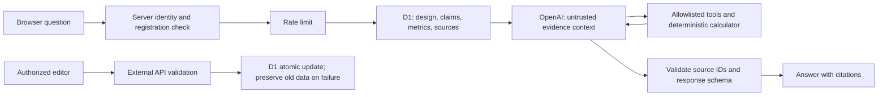

# Common Ground: local setup and implementation history

This is the EU AI datacenter research website for MIT 1.125 Assignment 3. It runs locally and has not been deployed. The sections below retain the implementation history; later dated updates supersede earlier descriptions of authentication, navigation, and validation status.

## Open the website

Preview: http://127.0.0.1:5173/

Dependencies and the local database are prepared on the development machine. Restart from the repository root:

```sh
npm run dev -- --hostname 127.0.0.1
```

Node.js 22.13 or later is required. The startup script also searches for the machine's Codex Node 24 runtime.

## Configure the two keys

Edit `.dev.vars` and fill the existing placeholders:

```dotenv
OPENAI_API_KEY=your_local_openai_key
EMBER_API_KEY=your_local_ember_key
OPENAI_MODEL=gpt-4.1-mini
EDITOR_USER_IDS=local_seedy
```

The energy data provider is **Ember**. Restart the development server after saving. Do not put keys in chat, React components, public environment variables, or data files. Git ignores `.dev.vars`; `.dev.vars.example` contains only a blank template. Deployment requires server-side secrets on the hosting platform; do not upload the local file.

The server calls the OpenAI Responses API with controlled data queries, source and human-verification records, and calculation tools. Answers include source citations. The client only receives configuration status. Each registered user has a daily limit of 20 requests. This application limit does not replace usage controls in the OpenAI project. At the initial setup stage no paid call had been made; model access needed account-specific validation. See later updates for subsequent tests.

## Original pages and contextual questions

| Page | Initial functionality |
| --- | --- |
| Explore Europe | EU27 boundaries, coverage status, country brief; Germany, France, Sweden selected by default |
| Compare countries | Compare 3–5 countries using consistent electricity prices, generation mix, carbon intensity, Epoch examples, and missing-data indicators |
| Initial design | Capacity assumptions, electrical diagram, component failure and 48-hour outage discussion, draft requirements and governance |
| Costs & scenarios | Build, lease, hybrid × base, grid delay, half utilization; ten-year cash flows, sensitivity, saving and export |
| Evidence library | Sources, definitions, retrieval dates, human-verification forms, editor refresh and logs |
| Adviser on every page | Conversation persists across navigation; current page, countries, scenario, and recent messages provide context for controlled calculations and citations |

## Initial local sign-in and human verification

The initial version required sign-in and registration before workspace access, including data and shared-design reads. Existing sessions continued without signing in again. Local preview uses a simulated identity, not real ChatGPT authentication. QA created a local profile named Local preview tester.

Initially, `local_seedy` was configured as an editor able to save the shared design, refresh data, and record verification. Later updates below restore public access and reserve shared-design changes for administrators. Production must use trusted authenticated IDs and verify each role.

Human verification is incomplete by default. A person must open the original source, check the specific claim, passage or table, units, and scope, then enter a note and confirm the declaration in the source drawer. A stored value is not evidence of human review. Refreshing a source retains old checks as historical records; the new version needs another review.

## Data and boundaries

- Eurostat: fixed period 2025-S2; non-household annual consumption of at least 150,000 MWh; EUR/kWh; recoverable taxes excluded. The snapshot has positive values for 17 countries; others remain unavailable. These are national references, not site quotations.
- Ember: EU27 electricity data for 2024. With a key, refresh can update demand, total generation, and generation carbon intensity for that year. Generation mix retains the archived snapshot, explicitly noted in the source details.
- Epoch AI: datacenter and historical GPU-cluster examples provide facility and hardware context. Record counts are not national facility totals.
- German, French, and Swedish official documents provide policy or project evidence awaiting human review. Original links and limitations appear in Evidence and `data/DATA_NOTES.md`.

Costs, financing, utilization, and equivalent GPU power are editable teaching assumptions. Supplier quotations, member demand commitments, and site grid agreements are absent. There is insufficient evidence for a final investment recommendation. Human verification, live integrations, production authentication, and final deliverables remain necessary.

## Initial validation results

At this stage, 11 model/server unit tests, 13 local API checks, TypeScript, and the production build passed. Desktop and 390px mobile layouts, parameter changes, sign-in, and missing-key messaging were checked. Tests created no human-verification records and made no paid AI calls.

Eurostat requests from the local Worker returned a runtime error, although the public URL was readable from the CLI and its response could be parsed. Failures were logged; the existing 27-country snapshot remained available for maps, comparisons, and calculations. At this stage keyed Ember and OpenAI integrations still required validation.

## Checks and maintenance

```sh
npm test
npm run typecheck
npm run build
npm run test:local
```

The last command requires the development server. It runs only against a loopback address, uses the local test identity, and may temporarily change and restore shared PUE. It neither fabricates human verification nor calls a paid model.

Local D1 data persist under `.wrangler/state`. At the initial setup stage, migrations 0000–0002 had been applied. Do not apply SQL files twice. On a fresh machine, install dependencies, build, and apply migrations in order. The original first three commands were:

```sh
node --import ./scripts/sites-env.mjs ./node_modules/wrangler/bin/wrangler.js d1 execute DB --local --config dist/server/wrangler.json --persist-to .wrangler/state --file drizzle/0000_messy_enchantress.sql
node --import ./scripts/sites-env.mjs ./node_modules/wrangler/bin/wrangler.js d1 execute DB --local --config dist/server/wrangler.json --persist-to .wrangler/state --file drizzle/0001_clever_katie_power.sql
node --import ./scripts/sites-env.mjs ./node_modules/wrangler/bin/wrangler.js d1 execute DB --local --config dist/server/wrangler.json --persist-to .wrangler/state --file drizzle/0002_wet_wendell_rand.sql
```

These historical commands are not the complete current migration list: later migrations in `drizzle/` must also be applied in order. A new database loads the sourced research snapshot on its first `/api/data` request. The project retains Sites hosting compatibility; no remote resources or website deployment were created during local setup.

## Interaction revision

- Typography: 17px body, 16px tables, generally 14–15px supporting text; larger chart values.
- Explore: fixed country comparison/filter area, proportional map, hover and keyboard details; mouse clicks avoid a default blue outline, keyboard focus retains an indicator.
- Compare: same-period electricity comparison; generation mix uses three grouped charts sharing a 0–100% scale and percentage labels.
- Initial Design: continuous reading with one diagram switching among normal operation, component failure, and a 48-hour outage.
- Costs: country, strategy, stress, and assumptions on the left; selection and results on the right.
- Adviser: changed from a standalone page to a persistent panel. The server validates the current page and last eight messages as context.
- Evidence: source table and human-verification records remain. Step 11 requires a filterable table; Step 13 requires at least three human-verified sources. Students must perform that review.

At this historical stage, login-first access conflicted with Step 22's public-design test. That conflict was later resolved by restoring public access. The Adviser panel retains questions, conversation, citations, identity status, and the initial-design limitation despite not having a separate route.

## Compact workspace and local identity

The workspace revision introduced top navigation and shared left-side inputs. The map scales with available height. Desktop Adviser reserves a right column; narrow screens use a dedicated conversation view. Annual costs, the full scenario matrix, and background details expand on demand. EU27 countries share flag and name rendering.

Sites starter local authentication uses a shared simulated account. It was already registered by QA, so it does not repeatedly request profile setup. This tests access flow, not real identity or isolation among real users. Production authentication and isolation require hosted validation. No cloud site was deployed.

The local SQLite file is under `.wrangler/state/v3/d1/miniflare-D1DatabaseObject/`, with logical binding `DB` and Drizzle as the access layer. Restarting does not erase it. The original nine business tables were users, countries, sources, cases, designs, verifications, refreshes, scenarios, and adviser_usage. Schema and migrations are in `db/schema.ts` and `drizzle/`. The historical read-only inventory was 27 countries, 8 sources, 6 cases, 1 shared design, 1 test user, 3 refresh logs, 0 human checks, 0 saved scenarios, and 0 AI usage records. Counts change with use and later migrations.

The facility area contains six selected Epoch records filtered by country. Jupiter, Jean Zay, and Berzelius are GPU-cluster examples; EcoDataCenter 2, Nebius Mantsala, and Sines are datacenter examples. They are neither available sites nor a national census. An empty country sample does not imply that the country has no datacenters.

## AI analysis driven by inputs

The initial summary revision retained `app/minimal-workspace.tsx`. After a registered user stopped changing annual GPU-hours, peak GPUs, scheduling utilization, PUE, strategy, or stress for 1.2 seconds, the committee-summary section requested analysis. France remained the provisional location at that stage.

`/api/adviser` with `purpose: summary` uses server identity checks, the shared daily 20-request limit, controlled calculation tools, and source validation. It returns a recommendation, three reasons, three uncertainties, and citations. Application code computes the numbers. Results for the same user, inputs, and evidence snapshot are cached in page memory for ten minutes, up to 20 entries. They do not persist in browser storage or overwrite the formal recommendation. Summary requests and chat share the quota.

Changing inputs hides the old AI answer immediately. Signed-out, unconfigured, failed, or rate-limited states retain a clearly labeled rule-based analysis of current inputs. Failed requests can be retried manually. Late responses cannot overwrite results for newer inputs.

## Demand-driven homepage revision

This revision collected annual productive GPU-hours, peak concurrent GPUs, candidate country, and optional opening budget. PUE and productive scheduling utilization were advanced assumptions. Supported inputs were 1–87.6 million annual GPU-hours and 1–10,000 equivalent peak GPUs. Example values are not verified demand.

Fleet sizing uses `ceil(max(peak GPUs, annual GPU-hours / (8760 × productive scheduling utilization)))`. Allocated IT power per GPU and PUE determine facility size. All strategies use that capacity. Half-utilization and grid-delay cases retain the base fleet rather than shrinking purchased assets. A separate 25 MW reference preserves 20 MW IT and PUE 1.25, with financial comparison for equivalent demand. If that reference cannot meet demand, it is labeled a hypothetical comparison.

Germany, France, and Sweden are the candidates. Selecting a country substitutes its national tariff. The budget filters pre-opening cash, not ten-year total spending. AI receives the same demand, results, country, strategy, stress, and budget; unavailable AI falls back to an explicitly labeled calculated summary. Detail links retain page-memory inputs and navigate to sizing, costs, reliability, or evidence. Reloading restores shared defaults.

At this stage 26 unit tests passed. Browser checks confirmed demand-driven capacity/capital changes, country and budget interactions, preserved detail-page inputs, and real AI explanations of sizing and budget. Costs remain teaching estimates; leased capacity and national tariffs are not supplier commitments.

## Committee review as the main workflow — 2026-10-05

The default homepage now reviews the original 20 MW IT, PUE 1.25, 25 MW proposal. It shows a fixed Send back decision, three reasons, and evidence that could change the decision. Build / Lease / Hybrid and all stress cases share team demand assumptions. Viewing a strategy does not endorse it. A smaller demand-sized design is a separate revision, not a replacement for the original proposal.

Registered users can run personal scenarios with dynamic inputs and AI summaries. Values remain in the page session and do not overwrite team assumptions. Returning to the team case restores formal review context. Team assumptions come from stored records with timestamps; they are not immutable published snapshots. Detailed design covers owned versus contracted systems, grid upgrades, cost allocation, and impacts on other users. Application code still computes the main metrics.

## Full requirements review and submission materials — 2026-10-05

The latest sections of [the requirements audit](docs/REQUIREMENTS_AUDIT.md) govern current status. At this review, 30 unit tests, 13 local API checks, type checking, and build passed. Two-page `output/pdf/investment-memo.pdf` and one-page `output/pdf/system-diagram.pdf` were checked for page count and rendered appearance. Committed copies are in `public/deliverables/`, linked from the site footer. They freeze the original 20 MW IT, PUE 1.25, France tariff 0.0614 EUR/kWh planning case and do not automatically follow later database revisions.

PDF source: `scripts/build-committee-pdfs.py`; calculation snapshot: `output/committee-values.json`. Re-export the snapshot using `evaluateCommitteeCase(caseDefaults, .0614)` before regenerating; do not manually rewrite financial results. Migration 0004 was applied locally; production must apply all migration versions through its migration process.

Remaining blockers: zero human checks; local Worker Eurostat internal error even after restarting with network permission; real Adviser retest returned daily-limit 429 without bypass; production Sites sign-in/deployment untested. Some legacy sources lack precise `retrievedAt`; the known 2026-10-03 archive review date must not be represented as an invented download timestamp. Historical test counts do not waive these blockers.

### Five-minute committee presentation outline

- 0:00–0:45: Homepage. Recommend returning for evidence rather than authorizing 25 MW construction spending; explain missing long-term commitments and unknown grid terms.
- 0:45–1:30: Demand. Identify 28m GPU-hours, 5,000 concurrent GPUs, and 70% scheduling as assumptions. Separate the demand-sized 12.5 MW case from the original 25 MW proposal. Explain member commitments and hardware benchmarks.
- 1:30–2:20: Alternatives. Use three strategies and four metrics to discuss ownership, lease minimums, and equivalent workload. Low modeled cost does not establish executability.
- 2:20–3:15: Stress. A one-year grid delay adds bridge leasing and pre-opening cash. Half utilization does not remove purchased equipment. Show ten-year facility and GPU cash flows separately.
- 3:15–4:05: System diagram. Explain UPS bridging, A/B paths, 48-hour generation, and unverified fuel/cooling conditions. The 99.9% figure is a target, not certification.
- 4:05–5:00: Recommendation and three decision-changing findings: committed demand, deliverable grid/site conditions, comparable supplier quotations. Explain protection for smaller members and what the committee could approve next.

Prepare to explain why the lowest tariff cannot establish a site choice; why directory counts cannot divide national consumption into average facility energy; why delay increases pre-opening cash; and which findings would support build or lease. Refer to statistical boundaries, cash-flow definitions, and the three evidence conditions.

### Two-minute demo script — not yet recorded

0:00–0:20: open the public homepage while signed out. 0:20–0:40: inspect strategies, stress, and calculation tooltips. 0:40–1:00: show country sources, dates, and classifications. 1:00–1:20: demonstrate real sign-in and first registration. 1:20–1:45: ask about current PUE and open a citation. 1:45–2:00: show an authorized successful refresh timestamp and retention of old data after failure. Record in a genuinely working environment; do not edit out current 429/refresh failures and claim successful acceptance.

### Software architecture and individual explanation



Each member should explain an actual request in their own words: the browser holds no API secret; the server checks identity and registration; team inputs are reconstructed from D1 rather than trusted from the client; controlled tools calculate and retrieve sources; the model explains evidence; the server rejects unknown citation IDs; the UI shows citations and uncertainty. This outline is not a completed individual presentation.

## Phase 7: course-aligned authentication and registration — 2026-10-05

Sites-provided `Sign in with ChatGPT` is retained. Email/password login, email codes, and user API-key collection were not added. Identity ID and email come only from Sites identity headers. First-time users provide name, course section, team, and explicit agreement to project rules; the database stores consent time and rules version. Incomplete legacy profiles must register before receiving registered-user permissions. Profile updates preserve existing roles and reject client-supplied identity, email, or role.

Server permissions: public design/evidence require no login; AI requires authentication and completed registration; refresh/verify require editor or admin; design PATCH and roles GET/PATCH require admin. Registered users are represented by `viewer` in the database. Account administrators can assign viewer/editor/admin, with changes recorded in `role_changes`. The self-entered team label is not an authorization boundary: this application has one shared consortium project. The interface cannot change one's own role or an environment-designated bootstrap administrator. Deployment must configure trusted Sites IDs in `ADMIN_USER_IDS`; registration cannot self-promote.

Migration 0005 adds course fields, consent records, and the role audit table; it was applied locally. All 32 unit tests, 16 local API checks, type checking, and build passed. Test modifications to the local profile were restored. Real Sites authentication remains pending hosted validation; the local account dialog explicitly identifies its shared simulated identity.

## Local API and source retrieval update — 2026-10-05

The local Miniflare Worker could not open outbound Eurostat sockets, although the host Node process could reach the official API. The development server now uses a fixed-target loopback bridge for the public Eurostat request; production remains a direct Worker request. A real `/api/refresh` call returned HTTP 200 and updated all 27 countries at `2026-10-05T20:53:22.098Z`. The source record now points to the exact `2025-S2` URL. This proves local API integration and D1 update, while hosted networking remains untested.

Six previously undated external sources have actual UTC retrieval times in `data/source-retrieval-audit.json`: the complete Ember and Epoch CSVs were downloaded and their archived in-scope rows matched field by field (459, 3, and 54); the three official source pages were fetched successfully. This is provenance, not a team member's human verification. Eurostat timestamps come from the successful refresh. The remaining undated `S-CALC` is the internal calculator and has no external retrieval date. See `data/DATA_NOTES.md` for limitations.
